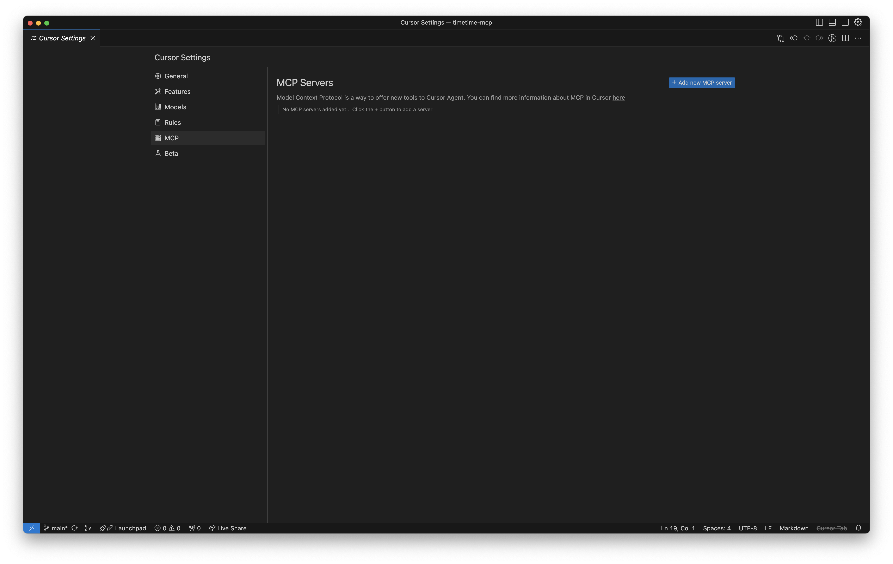
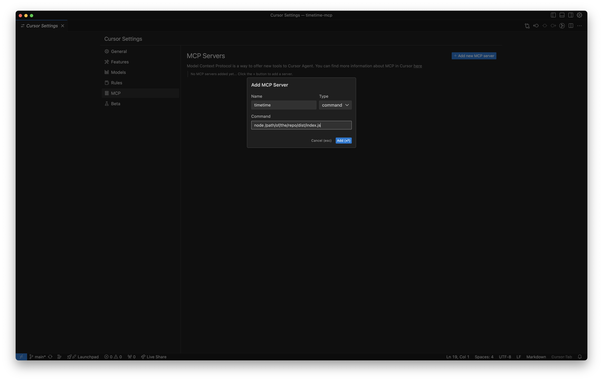
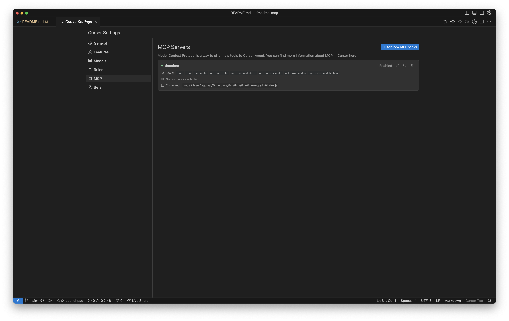

# TimeTime MCP Server

This is a simple MCP server that allows your agent to create a TimeTime client.

## Getting started

Clone this repo

```sh
git clone https://github.com/your-username/timetime-mcp.git
cd timetime-mcp
```

## Usage with cursor

This is a "node" command. We already ship the /dist folder with all the required stuff.

### Open cursor settings




### Add a new mcp

- Type: command
- Command node `<path-to-the-repo>/dist/index.js`



To get the path of the repo just type `pwd` in the terminal:

Usually you'll get something like:

```sh
/Users/your-username/Workspace/timetime/timetime-mcp
```

In our case:
```sh
/Users/iagolast/Workspace/timetime/timetime-mcp/dist/index.js
```


### Enjoy!

If you see a green dot it means that the server is up and running.



The MPC server is installed. You will need an api key to do actual server requests.


## Features

This can generate booking systems using TimeTime's API. For example a chatbot


- Provides a Model Context Protocol (MCP) server for TimeTime integration
- Includes tools for API documentation and interaction
- Supports various API endpoints for TimeTime functionality
- Helps AI agents build TimeTime applications

## API Tools

The MCP server exposes several tools to help agents work with the TimeTime API:

- `start`: Get an overview of the tool and how to interact with it
- `getMetaInfo`: List all available API endpoints
- `getAuthInfo`: Get authentication information
- `getEndpointDocs`: Detailed documentation for specific endpoints
- `getCodeSample`: Code examples for consuming endpoints
- `getErrorCodes`: Information about possible error responses
- `getSchemaDefinition`: Details about domain objects
- `run`: Execute API calls directly

## Contributing

Contributions are welcome! Please feel free to submit a Pull Request.

## License

This project is licensed under the MIT License - see the LICENSE file for details.
